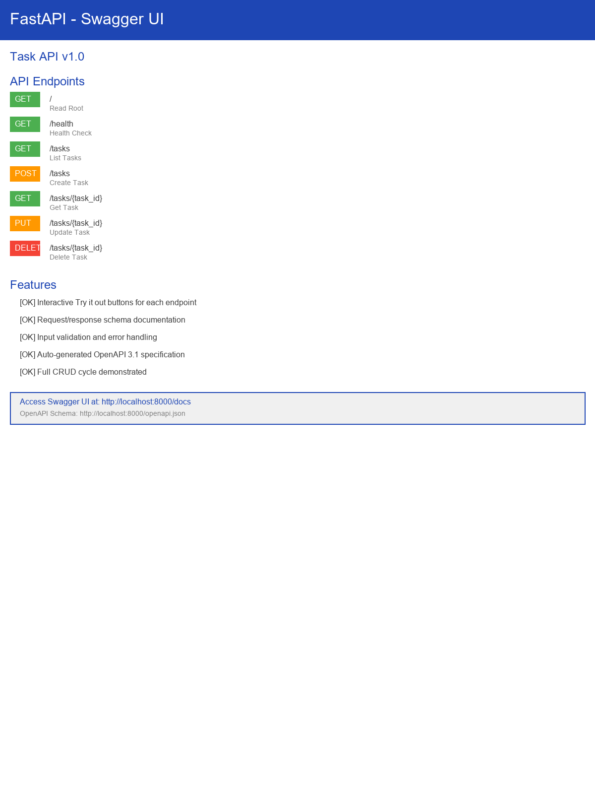

# Task API — A CRUD Backend for To-Do Lists

A simple, in-memory RESTful API for managing tasks. Built with FastAPI to demonstrate CRUD operations, HTTP status codes, request validation, and Swagger UI documentation.

## Quick Start

### 1. Install & Run (one command)

```bash
# Clone the repo (if not already done)
git clone https://github.com/radio12312/FLYRANK_TASK_1.git
cd FLYRANK_TASK_1

# Create and activate virtual environment
python -m venv venv

# Windows:
venv\Scripts\activate
# Mac/Linux:
source venv/bin/activate

# Install dependencies
pip install -r requirements.txt

# Run the server
uvicorn main:app --reload
```

Server runs at `http://localhost:8000`

### 2. Explore the API

**Browser:** Visit [http://localhost:8000/docs](http://localhost:8000/docs) for interactive Swagger UI

**Or use curl:**

```bash
# List all tasks
curl http://localhost:8000/tasks

# Get a single task
curl http://localhost:8000/tasks/1

# Create a new task
curl -X POST http://localhost:8000/tasks \
  -H "Content-Type: application/json" \
  -d '{"title":"Buy groceries","done":false,"id":1}'

# Update a task
curl -X PUT http://localhost:8000/tasks/1 \
  -H "Content-Type: application/json" \
  -d '{"title":"Buy groceries and cook","done":false,"id":1}'

# Delete a task
curl -X DELETE http://localhost:8000/tasks/1

# Check server health
curl http://localhost:8000/health
```

---

## API Endpoints

| Method | Path | Status | Description |
|--------|------|--------|-------------|
| GET | `/` | 200 | API info and available endpoints |
| GET | `/health` | 200 | Server health check |
| GET | `/tasks` | 200 | List all tasks |
| GET | `/tasks/{id}` | 200/404 | Get a single task; 404 if not found |
| POST | `/tasks` | 201/400 | Create a new task; 400 if title is empty |
| PUT | `/tasks/{id}` | 200/400/404 | Update a task; 400 if title invalid, 404 if not found |
| DELETE | `/tasks/{id}` | 204/404 | Delete a task; 204 no content, 404 if not found |

### Task Object

```json
{
  "id": 1,
  "title": "Buy milk",
  "done": false
}
```

---

## Example: Full CRUD Cycle

### 1. Create a task

```bash
$ curl -i -X POST http://localhost:8000/tasks \
  -H "Content-Type: application/json" \
  -d '{"title":"Learn FastAPI","done":false,"id":10}'

HTTP/1.1 201 Created
content-type: application/json
content-length: 54

{"id":4,"title":"Learn FastAPI","done":false}
```

### 2. List all tasks

```bash
$ curl http://localhost:8000/tasks

[{"id":1,"title":"Buy milk","done":false},{"id":2,"title":"Walk the dog","done":true},{"id":3,"title":"Write report","done":false},{"id":4,"title":"Learn FastAPI","done":false}]
```

### 3. Get a single task

```bash
$ curl http://localhost:8000/tasks/4

{"id":4,"title":"Learn FastAPI","done":false}
```

### 4. Update the task

```bash
$ curl -X PUT http://localhost:8000/tasks/4 \
  -H "Content-Type: application/json" \
  -d '{"title":"Learn FastAPI and build APIs","done":true,"id":4}'

{"id":4,"title":"Learn FastAPI and build APIs","done":true}
```

### 5. Delete the task

```bash
$ curl -i -X DELETE http://localhost:8000/tasks/4

HTTP/1.1 204 No Content
```

---

## Swagger UI

Open [http://localhost:8000/docs](http://localhost:8000/docs) in your browser to see interactive API documentation with "Try it out" buttons for each endpoint. Swagger UI reads the OpenAPI schema auto-generated by FastAPI.

**Features in Swagger UI:**
- View all endpoints with their methods and descriptions
- See request/response schemas
- Try each endpoint with custom values
- Automatic validation of inputs
- Full CRUD cycle in a visual interface



---

## Input Validation

The API validates incoming data:

- **Create (POST):** `title` field is required and cannot be empty
- **Update (PUT):** `title` field is required and cannot be empty
- Invalid requests return HTTP 400 Bad Request with an error message

Example validation error:

```bash
$ curl -i -X POST http://localhost:8000/tasks \
  -H "Content-Type: application/json" \
  -d '{}'

HTTP/1.1 400 Bad Request
content-type: application/json

{"detail":"title is required and cannot be empty"}
```

---

## Status Codes

The API uses standard HTTP status codes:

- **200 OK** — Request succeeded, data returned
- **201 Created** — Resource created successfully
- **204 No Content** — Request succeeded, no content to return (DELETE)
- **400 Bad Request** — Invalid input (empty title, missing fields)
- **404 Not Found** — Resource doesn't exist
- **422 Unprocessable Entity** — Validation error from Pydantic

---

## Data Storage

**⚠️ Important:** This API stores data in **memory only**. All tasks are lost when the server restarts. This is intentional for learning purposes.

To restart with fresh data:
```bash
# Simply restart the server
# Ctrl+C, then run: uvicorn main:app --reload
```

This in-memory design teaches why databases exist—*persistent storage* is next week's topic.

---

## Project Structure

```
.
├── main.py              # FastAPI application with all endpoints
├── requirements.txt     # Python dependencies (fastapi, uvicorn)
├── README.md            # This file
├── .gitignore           # Git ignore rules
└── venv/                # Python virtual environment (not committed)
```

---

## Development

### Run with auto-reload
```bash
uvicorn main:app --reload
```

### Run without auto-reload
```bash
uvicorn main:app
```

### Install more dependencies
```bash
pip install <package-name>
pip freeze > requirements.txt  # Update requirements
```

---

## Troubleshooting

**"Port 8000 already in use"**
```bash
# Use a different port
uvicorn main:app --port 8001
```

**"Module not found" errors**
```bash
# Activate virtual environment first
# Windows: venv\Scripts\activate
# Mac/Linux: source venv/bin/activate

# Then install dependencies
pip install -r requirements.txt
```

**"No module named fastapi"**
- Ensure virtual environment is active
- Run `pip install -r requirements.txt`

---

## Lessons Learned

1. **CRUD Operations** — Mapping SQL/data operations to HTTP methods (GET, POST, PUT, DELETE)
2. **HTTP Status Codes** — Using 200, 201, 204, 400, 404 to communicate outcomes
3. **Request Validation** — The server never trusts the client; always validate input
4. **In-Memory vs. Persistent** — Data in RAM vanishes on restart; that's why databases exist
5. **API Documentation** — Swagger UI auto-generated from code makes APIs discoverable

---

## Next Steps

- Add a database (Week 3): Replace the in-memory list with persistent storage
- Add authentication: Secure endpoints with JWT tokens or API keys
- Add query parameters: Filter tasks (e.g., `?done=true`) or search by title
- Deploy to the cloud: Host the API on AWS, Heroku, or similar

---

## Resources

- [FastAPI Documentation](https://fastapi.tiangolo.com)
- [HTTP Methods & Status Codes](https://developer.mozilla.org/en-US/docs/Web/HTTP)
- [RESTful API Design](https://restfulapi.net)
- [Swagger UI](https://swagger.io/tools/swagger-ui)

---

**Built for FlyRank Backend Track · Week 2 · Assignment A1**
